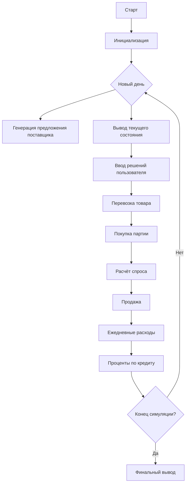
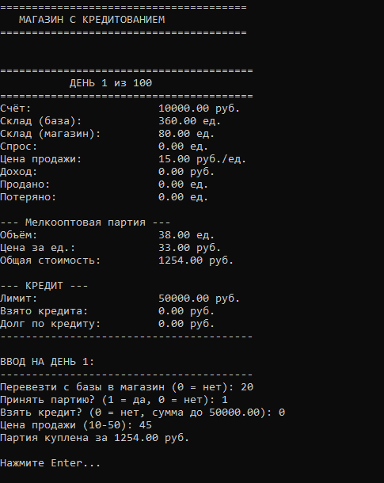
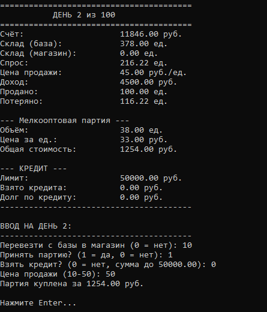
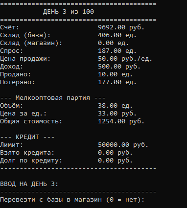

# 🏪 Модель магазина с кредитованием 

Данный проект — имитационная экономическая модель работы магазина с использованием кредитной линии.  

✅ Управление запасами  
✅ Перемещение товара между базой и магазином  
✅ Случайный спрос, зависящий от цены  
✅ Кредитование и начисление процентов  
✅ Пошаговое принятие решений пользователем  
✅ Итоговый финансовый результат  

---

## 📌 Постановка задачи

Необходимо смоделировать деятельность торгового предприятия в течение ограниченного периода времени, учитывая:

- начальный капитал и стартовые запасы
- периодические мелкооптовые поставки
- возможность брать кредит
- зависимость спроса от цены
- ежедневные расходы (аренда, зарплаты, налоги)
- ограничение по складу и наличности

Цель — исследовать устойчивость бизнеса и влияние стратегии управления ценами и закупками на финансовый результат.

---

## ⚙️ Описание модели

Модель реализована в виде интерактивной симуляции на C++, пользователь принимает решения каждый день.

| Переменная | Назначение |
|-----------|-----------|
| `account` | Денежные средства на счёте |
| `basicStore` | Запасы на базе |
| `shopStore` | Запасы в магазине |
| `retPrice` | Розничная цена |
| `demand` | Спрос |
| `sold`, `lost` | Продано / потеряно из-за нехватки |
| `creditDebt`, `creditTaken` | Кредит и задолженность |
| `offerVolume`, `offerPrice` | Объём и цена предложенной партии |
| `transferVol` | Товар, перевезённый в магазин |

---
### ⚡ Потоки 

| Поток | Формула | Значение |
|---|---|---|
| **Спрос** | `MAX_DEMAND * (MEAN_D_PRICE / retPrice) + шум` | Зависит от цены |
| **Продажи** | `min(shopStore, demand)` | Ограничены запасом |
| **Доход** | `sold * retPrice` | Денежный приток |
| **Расходы** | `700 + 200 + 500 = 1400 руб./день` | Ежедневные траты |
| **Проценты по кредиту** | `creditDebt * (0.15 / 365)` | Начисляются ежедневно |

---

## 🧾 Мелкооптовое предложение

Каждые **10 дней** появляется предложение на закупку товара:

| Параметр | Значение |
|---|---|
| Объём партии | 30–50 ед. |
| Цена единицы | 30–40 руб. |
| Режим оплаты | Только единоразово (или кредит, если не хватает денег) |

Если средств недостаточно — пользователь может **взять кредит**, если лимит позволяет.

---

## 💳 Кредитная линия

| Параметр | Значение |
|---|---|
| Лимит кредита | 50 000 руб. |
| Процентная ставка | 15% годовых |
| Начисление процентов | Ежедневно |

Пользователь сам вводит сумму кредита при необходимости.  

---

## 🔁 Обобщённый алгоритм программы

### Основные блоки

1. Получение инициализационных данных
2. Инициализация модели
3. Генерация поставок каждые N дней
4. Ввод решений пользователя:
   - перевозка товара
   - покупка партии
   - изменение цены
   - взятие кредита
5. Расчёт спроса
6. Продажа товара
7. Учёт расходов
8. Начисление процентов по кредиту
9. Вывод данных
10. Проверка конца моделирования

### Диаграмма

---

## 🧠 Основные параметры модели

| Параметр | Значение |
|---|---|
| `INIT_ACCOUNT` | 10 000 руб. |
| `BASIC_STORE_INIT` | 360 ед. |
| `SHOP_STORE_INIT` | 80 ед. |
| `SIMULATION_DAYS` | 100 |
| `DAILY_SPENDING` | 700 руб. |
| `RENT_RATE` | 200 руб. |
| `WAGES_AND_TAXES` | 500 руб. |
| `CREDIT_LIMIT` | 50 000 руб. |
| `CREDIT_RATE` | 15% годовых |

---

## 🖼️ Cкриншоты День 1 
  

### День 2 
  

### День 3
  

---

## Файлы проекта

| Файл | Описание |
|------|----------|
| **[Код программы](IMMOD3.cpp)** | Полный исходный код симулятора на C++ |
| **[Скриншот 1](1.png)** | Состояние модели в первый день |
| **[Скриншот 2](2.png)** | Состояние модели во второй день |
| **[Скриншот 3](3.png)** | Состояние модели в третий день |
| `README.md` | Данный файл |

